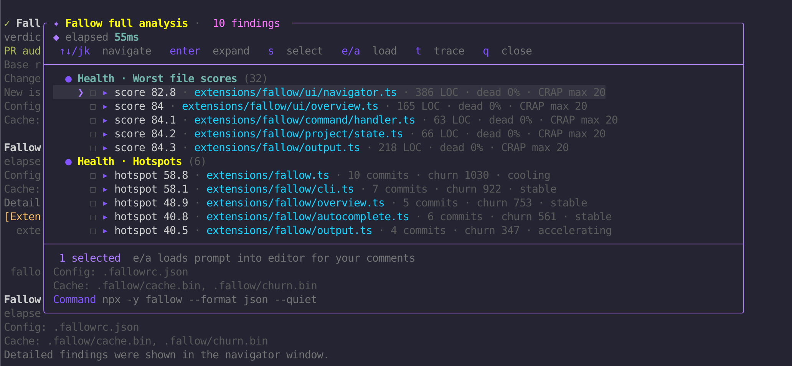

# Pi Fallow

[](https://www.npmjs.com/package/pi-fallow)
[](https://www.npmjs.com/package/pi-fallow)
[](https://github.com/revazi/pi-fallow/actions/workflows/ci.yml)
[](https://codecov.io/gh/revazi/pi-fallow)
[](./LICENSE)

Pi Fallow connects [Fallow](https://fallow.tools/docs/) to the [Pi coding agent](https://github.com/earendil-works/pi): you get a `fallow_run` tool for agent workflows and a `/fallow` slash command for interactive checks.

Use it when you want Pi to verify changes, review a PR, find dead code, inspect duplication, check maintainability, or trace whether something is safe to remove.



*Pi Fallow checking the pi-fallow package itself.*

## Highlights

- **Compact agent tool:** `fallow_run` uses a small command-plus-args contract while preserving internal validation and older-session compatibility.
- **Slash command:** `/fallow ...` runs the Fallow CLI from inside Pi; `/fallow` and `/fallow run` use a configurable default command.
- **PR shortcut:** `/fallow pr` maps to `audit --base <detected-base> --gate new-only`.
- **Rerun shortcut:** `/fallow rerun` repeats the last `/fallow` command.
- **Non-blocking autocomplete:** subcommands, flags, enum values, static refs, and asynchronously discovered project branch refs are suggested without running Git while you type.
- **Interactive navigator:** every actionable finding remains navigable with search, section/severity filters, multi-selection, tracing, and editor loading; informational file scores/hotspots are classified separately.
- **Run-mode support:** `/fallow` executes in TUI, RPC, JSON, and print modes; terminal loaders and navigator overlays are TUI-only, while non-TUI modes retain full transcript output.
- **Robust output parsing:** direct or noisy embedded JSON is scanned once with nesting, strings, and escapes handled correctly.
- **Safe defaults:** JSON and quiet output are added when appropriate; complete output is saved to a temp file whenever transcript or navigator data omits fields, and released from retained engine state after formatting. Pi Fallow never automatically deletes saved reports.
- **Cached CLI lookup:** resolves `FALLOW_BIN`, `fallow` from `PATH`, or a package-local installation once per project/session before falling back to `npx -y fallow`.

## Installation

Install from npm after publishing:

```bash
pi install npm:pi-fallow
```

Install directly from GitHub:

```bash
pi install git:github.com/revazi/pi-fallow
```

Try it locally without installing:

```bash
pi -e .
```

Or install the local checkout:

```bash
pi install .
# project-local install
pi install -l .
```

## Usage

Ask Pi things like:

- “Run a Fallow audit for this PR and fix introduced dead code.”
- “Find duplicate code, trace the largest clone group, then suggest a refactor.”
- “Inspect this file with Fallow before editing it.”
- “Run Fallow security candidates for the changed files and explain what needs verification.”
- “Run Fallow health and tell me the safest maintainability improvement.”
- “Preview Fallow auto-fixes before applying anything.”

Manual slash command examples:

```text
/fallow
/fallow run
/fallow run --score
/fallow pr
/fallow rerun
/fallow about
/fallow audit --base origin/main --gate new-only
/fallow check-changed --changed-since main
/fallow dead-code --changed-since main
/fallow dupes --changed-since main
/fallow health --file-scores --targets --score
/fallow inspect --file extensions/fallow/cli.ts
/fallow inspect --symbol extensions/fallow/cli.ts:fallowCli
/fallow explain unused-export
/fallow trace extensions/fallow/cli.ts:fallowCli
/fallow trace-file extensions/fallow/ui.ts
/fallow trace-export extensions/fallow/ui.ts FallowIssueNavigator
/fallow security --changed-since main --gate new
/fallow decision-surface --changed-since main
/fallow workspaces
/fallow schema
/fallow coverage analyze
```

`/fallow` and `/fallow run` execute `health` by default. Set `PI_FALLOW_DEFAULT_COMMAND` to a shell-free Fallow command string to change it, for example:

```bash
export PI_FALLOW_DEFAULT_COMMAND='health --complexity --targets --score'
```

Arguments after `/fallow run` are appended to the configured default. Explicit commands such as `/fallow dupes` are never replaced. Recursive/extension-only defaults such as `run`, `rerun`, or `about` are rejected.

`/fallow check-changed` is a Pi Fallow convenience alias for Fallow's combined root analysis with `--changed-since`.

The agent-facing `fallow_run` tool passes command-specific flags as separate `args` tokens. For example, a PR audit uses `{ "command": "audit", "args": ["--base", "main", "--gate", "new-only"] }`. Manual `/fallow` command syntax is unchanged.

`/fallow about` shows the installed Pi Fallow version, latest npm version, update command, and project links. Pi Fallow also checks npm once per TUI session and shows a non-blocking warning when a newer version is available. Update an npm installation with `pi update npm:pi-fallow`. Set `PI_FALLOW_DISABLE_UPDATE_NOTICE=1` to disable startup update notices.

Saved full reports remain in the operating system's temporary directory. Pi Fallow never deletes them automatically; the operating system's own temporary-file retention policy still applies.

In the interactive navigator:

- `↑↓` or `j/k` — move
- `Enter` / `Space` — expand the selected finding
- `s` — select/unselect
- `A` — select/unselect all findings visible under the active filters
- `/` — search section, label, path, severity, details, and suggested action
- `f` / `v` — cycle section/severity filters
- `x` — clear filters; `c` — clear explicit selections
- `i` — show/hide informational file scores and hotspots; they are hidden by default and never counted as findings
- `d` — toggle full raw finding JSON in the agent prompt; it is deselected by default
- `e` or `a` — load selected findings into the editor
- `t` — run a trace for the selected finding when possible
- `q` / `Esc` — close (`Esc` first cancels an active search)

The navigator defaults to compact prompts. Compact mode includes every selected finding with type, severity, location, subject, concise evidence/details, and suggested action, plus the complete-report path. Selecting the full-details checkbox additionally embeds complete raw JSON for every selected finding; the overlay warns that this can use substantially more model context.

Plain `fallow health` can return actionable findings alongside informational per-file scores and hotspots. Pi Fallow hides those informational records by default and reports their count separately. Explicit informational commands such as `health --file-scores` and `flags` show their records directly without finding-selection or agent-prompt controls. The overlay stays centered at 90% terminal width, can use up to 95% of terminal height, and expands large virtualized result sets to as many as 30 visible rows.

## Requirements

- Node.js 22.19+
- Pi coding agent
- Fallow available through one of:
  - `FALLOW_BIN=/path/to/fallow`
  - `fallow` on `PATH`
  - a package-local Fallow installation
  - `npx -y fallow` fallback

Runner resolution is refreshed when `FALLOW_BIN` or `PATH` changes. The npx fallback locates the installed package once and invokes its executable directly for later commands. If an automatically resolved executable disappears, Pi Fallow invalidates it and retries the next route once. An invalid explicit `FALLOW_BIN`, cancellation, timeout, or a command that already started never falls through to another installation.

The Pi package declares Pi libraries as peer dependencies, as recommended for Pi extensions.

## Package manifest

`package.json` exposes the extension through the Pi package manifest:

```json
{
  "keywords": ["pi-package", "pi-extension"],
  "pi": {
    "extensions": ["./extensions/index.ts"],
    "image": "https://raw.githubusercontent.com/revazi/pi-fallow/main/pi-fallow.png"
  }
}
```

## Development

See [CONTRIBUTING.md](./CONTRIBUTING.md) for contribution guidelines and [SECURITY.md](./SECURITY.md) for vulnerability reporting.

Useful checks:

```bash
npm run check:bundle
npm run health
npm run dupes
npm run coverage
npm run audit:production
npm run package:smoke
npm run pack:check
npm run bench:tokens -- --label candidate --output /tmp/pi-fallow-token-candidate.json
npm run bench:tokens:compare -- benchmarks/baselines/v0.2.0.json /tmp/pi-fallow-token-candidate.json
npm run bench:performance -- --label candidate --output /tmp/pi-fallow-performance-candidate.json
npm run bench:performance:compare -- benchmarks/baselines/performance-v0.2.0.json /tmp/pi-fallow-performance-candidate.json
```

See the [token benchmark documentation](https://github.com/revazi/pi-fallow/blob/main/benchmarks/README.md) and [performance benchmark documentation](https://github.com/revazi/pi-fallow/blob/main/benchmarks/PERFORMANCE.md) for the frozen before states and comparison methodology.

This repo includes `.fallowrc.json` so Fallow knows the Pi entrypoint is `extensions/index.ts` and treats TUI component callbacks such as `handleInput` and `invalidate` as framework-used.

## License

MIT © Revaz Zakalashvili
