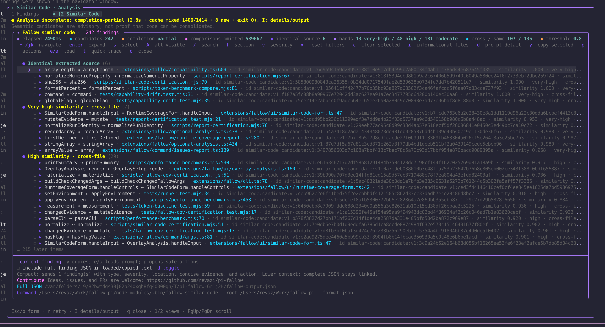

# Pi Fallow

[](https://www.npmjs.com/package/pi-fallow)
[](https://www.npmjs.com/package/pi-fallow)
[](https://github.com/revazi/pi-fallow/actions/workflows/ci.yml)
[](https://codecov.io/gh/revazi/pi-fallow)
[](./LICENSE)

Pi Fallow connects [Fallow](https://fallow.tools/docs/) to the [Pi coding agent](https://github.com/earendil-works/pi). It adds:

- `fallow_run`, a compact tool for agent workflows;
- `/fallow`, a slash command for interactive analysis; and
- a TUI navigator for reviewing, filtering, tracing, and selecting findings.

Use it to verify changes, review a PR, find dead code or duplication, inspect maintainability, surface security candidates, and trace whether code is safe to remove.




## Install

```bash
pi install npm:pi-fallow
```

Other supported sources:

```bash
pi install git:github.com/revazi/pi-fallow
pi install .       # local checkout
pi install -l .    # project-local checkout
pi -e .            # try without installing
```

## Quick start

Run the issue-focused default:

```text
/fallow
```

This combines dead-code, duplication, health, and security analysis into one actionable report. Informational file scores, hotspots, and advisory refactoring targets remain available through explicit health commands but do not inflate the default issue count.

Common commands:

```text
/fallow issues
/fallow health --file-scores --targets --score
/fallow dead-code --changed-since main
/fallow dupes --changed-since main
/fallow security --changed-since main --gate new
/fallow audit --base origin/main --gate new-only
/fallow pr
/fallow inspect --file extensions/fallow/cli.ts
/fallow trace extensions/fallow/cli.ts:fallowCli
/fallow architecture extensions/fallow/cli.ts extensions/fallow/registry.ts
/fallow decision-surface --changed-since main
/fallow history
/fallow compatibility
/fallow config-assist
/fallow similar-code status
```

`/fallow pr` is shorthand for an audit against the detected base with a new-only gate. `/fallow rerun` repeats the last analysis. `/fallow architecture <file>...` maps to Fallow's read-only `guard` command.

Set a shell-free custom default with `PI_FALLOW_DEFAULT_COMMAND`:

```bash
export PI_FALLOW_DEFAULT_COMMAND='health --complexity --targets --score'
```

Explicit subcommands are never replaced. Recursive and extension-only commands cannot be configured as the default.

## Agent tool

`fallow_run` accepts a command, separate CLI-token arguments, an optional root and timeout, and an output detail level:

```json
{
  "command": "audit",
  "args": ["--base", "main", "--gate", "new-only"],
  "detail": "findings"
}
```

Detail levels:

- `summary` — status and counts;
- `findings` — bounded normalized findings with locations and actions (default);
- `raw` — bounded raw Fallow output for diagnostics.

Bounded responses link to a complete report whenever data is omitted. Before deletion, inspect or trace the target; treat incomplete type-aware evidence as advisory; and preview fixes before applying them.

## Interactive navigator

The TUI keeps every actionable finding navigable while defaulting to a compact model prompt.

| Key | Action |
|---|---|
| `↑`/`↓`, `j`/`k` | Move |
| `Enter`/`Space` | Expand finding |
| `/` | Search |
| `f` / `v` | Cycle section/severity filters |
| `s` / `A` | Select one/all visible findings |
| `p` | Open read-only action palette |
| `t` | Run the first valid trace action |
| `e` or `a` | Load selected findings into the editor |
| `y` | Copy selected findings |
| `d` | Toggle full raw detail |
| `i` | Toggle informational health context |
| `q` / `Esc` | Close or dismiss the current control |

The action palette supports safe inspection, explanation, tracing, symbol impact, and architecture lookup. Fixes are limited to explicit project-wide dry-run previews; the navigator never applies them.

### Similar Code

Similar Code is explicit, local-model, and advisory. It never runs as part of the default report, audits, security analysis, or automatic fixes.

Open the persistent overlay with `2` or `o`. From its Similar Code view:

- `r` refreshes readiness;
- `s`, `t`, and `l` edit scope, threshold, and result limit;
- `c` opts into reuse of project-local embeddings (off by default);
- `v` validates without running;
- `Enter` validates and requests a run when not editing;
- uppercase `S` opens the setup preview, and only `y` confirms installation.

Setup and analysis stay in the overlay, support cancellation, retain their latest result, and never run automatically. Cold inference may require the download size reported by `similar-code status` and can take minutes. Complete reports remain separate files for reproducible inspect/review steps.

The Runtime Coverage overlay tab is currently disabled because the interactive flow does not yet model the sidecar's single-capture versus licensed multi-capture boundary clearly enough. Direct Fallow runtime-coverage commands remain available.

### History

Pi Fallow keeps up to 20 completed slash-command reports in branch-aware, project-isolated session metadata:

```text
/fallow history
/fallow history open r1
/fallow history compare r1 r2
/fallow history clear
```

Reports must still exist and match their recorded digest. Comparisons require compatible, complete scopes and never guess when identity evidence is missing. History is session-local and Pi Fallow never deletes saved reports automatically.

## Configuration and compatibility

`/fallow config-assist` performs a bounded read-only inspection of the discovered Fallow configuration. It can preview one schema-recognized rule severity without exposing resolved values or secrets.

Applying a preview is TUI-only. Apply requires a direct confirmation; repeated discovery, schema, and content checks ensure concurrent drift or cancellation refuses the write. Existing files receive byte-exact backups and atomic replacements; inherited or external configuration remains read-only.

`/fallow compatibility` compares the installed Fallow capability schema with the certified surface. It reports additive and incompatible capabilities, never installs software or runs during startup, and never gates ordinary execution.

## Run modes and safety

- TUI mode uses loaders and the interactive navigator.
- RPC, print, and JSON modes execute directly and retain complete transcript output without terminal UI.
- Arguments are passed as arrays without a shell.
- Cancellation terminates process trees and escalates when necessary.
- Large model-facing results are bounded and preserve complete-output references.
- Pi host packages remain external and are never bundled.
- Optional model setup requires an explicit TUI preview and confirmation.

## Tested compatibility

| Pi coding agent | Matching Pi AI/TUI packages | Node.js | Fallow |
|---|---|---|---|
| 0.85.1 | 0.85.1 | 22.19 and 24 | 3.24.1 |

**Certification** means this exact matrix passed frozen and live repository checks. **Compatibility** means the installed Fallow still advertises the capabilities Pi Fallow models. **Installation constraints** are only the requirements below. This is tested compatibility; it is not an installation constraint, and other versions may work.

Pi libraries are host-provided wildcard peer dependencies, following Pi package guidance; the tested matrix does not narrow those peer ranges.

## Requirements

- Node.js 22.19+
- Pi coding agent
- Fallow available through `FALLOW_BIN`, `PATH`, a package-local installation, or the `npx -y fallow` fallback

Fallow 3.24.1 is the current certification target. Runner discovery is cached per project/session and refreshed when relevant environment values change.

## Development

```bash
npm test
npm run coverage
npm run check:bundle
npm run health
npm run dupes
npm run dead-code
npm run audit:all
npm run package:smoke
npm run bench:tokens -- --label candidate --output /tmp/pi-fallow-tokens.json
npm run bench:performance -- --label candidate --output /tmp/pi-fallow-performance.json
npm run bench:issues -- --label candidate --output /tmp/pi-fallow-project-issues.json
```

See [CONTRIBUTING.md](./CONTRIBUTING.md), [ROADMAP.md](./ROADMAP.md), [benchmark documentation](./benchmarks/README.md), and [performance methodology](./benchmarks/PERFORMANCE.md).

The package manifest exposes `./extensions/index.ts`. Pi libraries and TypeBox are external wildcard peers, not bundled dependencies.

## License

MIT © Revaz Zakalashvili
