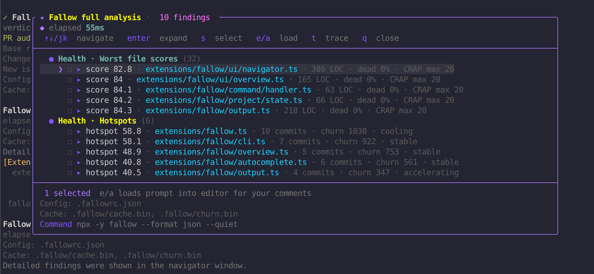

# Pi Fallow

[](https://www.npmjs.com/package/pi-fallow)
[](https://www.npmjs.com/package/pi-fallow)
[](https://github.com/revazi/pi-fallow/actions/workflows/ci.yml)
[](https://codecov.io/gh/revazi/pi-fallow)
[](./LICENSE)

Pi Fallow connects [Fallow](https://fallow.tools/docs/) to the [Pi coding agent](https://github.com/earendil-works/pi): you get a `fallow_run` tool for agent workflows and a `/fallow` slash command for interactive checks.

Use it when you want Pi to verify changes, review a PR, find dead code, inspect duplication, check maintainability, or trace whether something is safe to remove.



*Pi Fallow checking the pi-fallow package itself.*

## Highlights

- **Compact agent tool:** `fallow_run` uses a small command-plus-args contract while preserving internal validation and older-session compatibility.
- **Synchronized command contract:** one typed registry drives tool commands, compact CLI prefixes, slash aliases, autocomplete, and the `/fallow` argument hint.
- **Useful default:** `/fallow`, `/fallow run`, and `/fallow issues` aggregate project-wide dead-code, duplication, health, and security findings into one issue-focused report; per-file health context is omitted.
- **Slash command:** `/fallow ...` runs Fallow from inside Pi, with direct subcommands retained and a configurable default command.
- **PR shortcut:** `/fallow pr` maps to `audit --base <detected-base> --gate new-only`.
- **Rerun shortcut:** `/fallow rerun` repeats the last `/fallow` command.
- **Non-blocking autocomplete:** subcommands, flags, enum values, static refs, and asynchronously discovered project branch refs are suggested without running Git while you type.
- **Interactive navigator:** every actionable finding remains navigable with search, section/severity filters, multi-selection, command-aware read-only actions, tracing, and editor loading; informational file scores/hotspots are classified separately.
- **Run-mode support:** `/fallow` executes in TUI, RPC, JSON, and print modes; terminal loaders and navigator overlays are TUI-only, while non-TUI modes retain full transcript output.
- **Robust output parsing:** direct or noisy embedded JSON is scanned once with nesting, strings, and escapes handled correctly.
- **Safe defaults:** JSON and quiet output are added when appropriate; complete output is saved to a temp file whenever transcript or navigator data omits fields, and released from retained engine state after formatting. Pi Fallow never automatically deletes saved reports.
- **Cached CLI lookup:** resolves `FALLOW_BIN`, `fallow` from `PATH`, or a package-local installation once per project/session before falling back to `npx -y fallow`.
- **Stable type-aware reports:** Fallow semantic symbol impact and advisory public-signature coupling can be requested through both Pi surfaces, with completeness and advisory status kept visible.
- **Opt-in semantic similarity:** `/fallow similar-code` and `fallow_run(command: "similar-code")` expose Fallow's pinned local-model workflow without adding candidates to default checks or downloading model artifacts.

## Installation

Install from npm after publishing:

```bash
pi install npm:pi-fallow
```

Install directly from GitHub:

```bash
pi install git:github.com/revazi/pi-fallow
```

Try it locally without installing:

```bash
pi -e .
```

Or install the local checkout:

```bash
pi install .
# project-local install
pi install -l .
```

## Usage

Ask Pi things like:

- “Run a Fallow audit for this PR and fix introduced dead code.”
- “Find duplicate code, trace the largest clone group, then suggest a refactor.”
- “Inspect this file with Fallow before editing it.”
- “Show which architecture rules apply to these files before changing them.”
- “Run Fallow security candidates for the changed files and explain what needs verification.”
- “Run Fallow health and tell me the safest maintainability improvement.”
- “Preview Fallow auto-fixes before applying anything.”

Manual slash command examples:

```text
/fallow
/fallow issues
/fallow run
/fallow run --score
/fallow pr
/fallow rerun
/fallow about
/fallow audit --base origin/main --gate new-only
/fallow check-changed --changed-since main
/fallow dead-code --changed-since main
/fallow dead-code --type-aware --symbol-impact extensions/fallow/cli.ts:fallowCli
/fallow dupes --changed-since main
/fallow health --file-scores --targets --score
/fallow health --type-aware --type-coupling
/fallow inspect --file extensions/fallow/cli.ts
/fallow inspect --symbol extensions/fallow/cli.ts:fallowCli
/fallow explain unused-export
/fallow trace extensions/fallow/cli.ts:fallowCli
/fallow trace-file extensions/fallow/ui.ts
/fallow trace-export extensions/fallow/ui.ts FallowIssueNavigator
/fallow security --changed-since main --gate new
/fallow architecture extensions/fallow/cli.ts extensions/fallow/registry.ts
/fallow decision-surface --changed-since main
/fallow similar-code status
/fallow similar-code --file extensions/fallow/cli.ts --top 10
/fallow similar-code inspect sc_example --candidates similar-code.json
/fallow similar-code review --candidates similar-code.json --verdicts verdicts.json
/fallow workspaces
/fallow schema
/fallow coverage analyze
```

`/fallow`, `/fallow run`, and `/fallow issues` run Pi Fallow's project-issue aggregation by default. It executes Fallow's combined dead-code, duplication, and health analysis followed by the opt-in security-candidate analysis, then opens one navigator containing only actionable findings. Informational health file scores and hotspots are intentionally omitted so a clean project does not produce a browser full of files. Security entries remain candidates that require agent verification, not confirmed vulnerabilities.

The aggregate accepts curated options that can be applied safely to one or both analyses, including `--changed-since`, `--workspace`, `--production`, `--score`, type-aware controls, runtime coverage, and `--surface`. Use an explicit command such as `/fallow health --file-scores` for command-specific informational output. `/fallow all` remains direct access to Fallow's native combined root report and does not add the separate security scan.

Set `PI_FALLOW_DEFAULT_COMMAND` to a shell-free command string to replace the aggregate default, for example:

```bash
export PI_FALLOW_DEFAULT_COMMAND='health --complexity --targets --score'
```

Arguments after `/fallow run` are appended to the configured default. Explicit commands such as `/fallow dupes` are never replaced. Recursive or extension-only defaults such as `run`, `rerun`, `history`, or `about` are rejected.

`/fallow check-changed` is a Pi Fallow convenience alias for Fallow's combined root analysis with `--changed-since`.

`/fallow architecture <file>...` maps to Fallow's stable `guard <file>...` command. The first file is required, multiple files and flags are preserved, and Pi's optional leading `@` is removed only from positional path targets (not flag values). Direct raw `/fallow guard ...` access remains available.

The agent-facing `fallow_run` tool passes command-specific flags as separate `args` tokens. For example, a PR audit uses `{ "command": "audit", "args": ["--base", "main", "--gate", "new-only"] }`, while an architecture query uses `{ "command": "architecture", "args": ["src/api.ts", "src/domain.ts"] }`. Type-aware reports use the existing structured commands, for example `{ "command": "dead-code", "args": ["--type-aware", "--symbol-impact", "src/api.ts:Client"] }` or `{ "command": "health", "args": ["--type-aware", "--type-coupling"] }`. Other manual `/fallow` command syntax is unchanged.

`fallow_run.detail` controls model-facing output and defaults to `findings`. Use `summary` for bounded status and counts, `findings` for bounded normalized findings with locations, evidence, and suggested actions, or `raw` for bounded raw Fallow JSON/output. Summary and findings responses always link to a complete report in the operating system's temporary directory; raw responses do so when truncation omits content. This setting does not change `/fallow` slash-command or navigator rendering.

When `fallow_run` is active, its compact Pi prompt guidance tells the model to inspect or trace before deletion, treat incomplete type-aware evidence as advisory, preview fixes before applying them, avoid unrequested changes, and reserve raw detail for necessary diagnostics.

`--type-aware-project` selects a TypeScript project and `--type-aware-require best-effort|complete` controls required completeness. Always inspect the returned type-aware completeness, omissions, and abstentions: incomplete evidence remains advisory and must not be treated as exact delete-safety proof. Fallow also supports `--baseline-mode count|identity` for health baselines and `--no-type-aware` to override config for a syntactic-only run.

### Opt-in similar-code analysis

`/fallow similar-code` and `fallow_run` with `command: "similar-code"` expose Fallow's semantic similar-code workflow explicitly. It is never part of `/fallow`, `/fallow issues`, audits, security checks, or automatic fixes. Raw candidates are unverified advisory leads—not deterministic clone findings or proof that a consolidation is safe. Check `completion.status`, phase skips, diagnostics, model provenance, both source locations, and enrichment availability before drawing conclusions. Only `completion.status: "complete"` makes an empty result conclusive for the admitted scope.

Start with `/fallow similar-code status`. This reads no project source and reports the exact companion, pinned model identifier/revision, license, integrity state, download size, cache directory, and readiness. Pi Fallow never runs `similar-code setup` or cache mutation and never downloads a model or sidecar. After reviewing those details, a user who chooses to install the pinned model must run `fallow similar-code setup --local` directly outside Pi Fallow.

Inference uses Fallow's version-pinned local companion and reports whether source left the machine; the current contract requires local-only source processing. Model vectors live in Fallow's user-local, project-namespaced cache, while saved candidate reports remain independent JSON documents for reproducible inspect/review steps. Cold inference can take minutes and currently requires roughly the download size reported by `similar-code status` (about 310 MiB for Fallow 3.21); warm cached runs should be faster but remain project- and hardware-dependent. Pi Fallow allows up to 15 minutes by default for this explicit command, while cancellation and `FALLOW_TIMEOUT_SECS` or tool `timeoutSecs` overrides remain available.

Use discovery once and preserve its complete JSON report. `similar-code inspect` validates one candidate against that saved report and current source hashes; `similar-code review` joins the unchanged candidates with a separate verdict document. Missing setup, partial/provider failures, stale inspection evidence, verdict-join failures, cancellation, and timeout remain distinct result states. A separate review verdict should abstain whenever source-grounded evidence is incomplete.

Some Fallow surfaces deliberately remain direct CLI features rather than Pi Fallow report commands:

- `fallow type-aware status --format json --quiet` probes companion availability but is not an analysis report.
- `fallow report --from report.json --format sarif` re-renders a saved file instead of analyzing the current project.
- `fallow viz --no-open --viz-format html` writes browser/file output rather than a structured finding report.

Pi Fallow therefore does not add these status/file/browser operations to `fallow_run` or its report navigator.

`/fallow about` shows the installed Pi Fallow version, latest npm version, update command, and project links. Pi Fallow also checks npm once per TUI session and shows a non-blocking warning when a newer version is available. Update an npm installation with `pi update npm:pi-fallow`. Set `PI_FALLOW_DISABLE_UPDATE_NOTICE=1` to disable startup update notices.

### Session run history and comparison

Every completed `/fallow` analysis and trace is added to bounded in-memory session history. `/fallow history` (or `history list`) shows the current project's runs; `/fallow history open r1` reopens an unchanged retained report in the existing navigator; `/fallow history compare r1 r2` treats the first run as prior and the second as current; and `/fallow history clear` removes only the current project's history metadata. History commands never replace `/fallow rerun`, which continues to execute the last analysis command.

History retains at most the 20 most recent completed slash-command results across the Pi session, partitioned by resolved project root. Entries record a bounded command-scope digest, completion timestamp, Fallow/schema versions, report kind, counts, exit/completeness state, complete-report path and digest, and Git `HEAD` when available. Raw reports and overviews are not retained in the history object. There is no cloud storage or cross-session persistence, and run IDs from another root cannot be opened or discovered.

Comparison is deliberately conservative. Both reports must still exist unchanged and have complete results with the same command scope, report kind, schema version, and Fallow version. Stable finding IDs take priority. Otherwise, identity uses type, path, and subject while ignoring line numbers, so ordinary line shifts match; path changes are shown as new plus resolved unless a stable ID proves continuity. Missing identities, duplicate identities, incomplete reports, drifted files, and incompatible versions/scopes are reported as unavailable rather than guessed. New and unchanged findings remain current actionable findings; resolved and unavailable entries are context only and can never be selected as current work.

TUI history opens and comparisons use the existing navigator and action flow. RPC and print modes emit bounded text without opening custom UI; JSON mode emits structured history/open/comparison payloads without opening custom UI. Session restart, the 20-entry bound, explicit `history clear`, or operating-system temporary-file cleanup can expire an entry. Clear and eviction never delete report files.

Saved full reports remain in the operating system's temporary directory. Pi Fallow never deletes them automatically; the operating system's own temporary-file retention policy still applies.

In the interactive navigator:

- `↑↓` or `j/k` — move
- `Enter` / `Space` — expand the selected finding
- `s` — select/unselect
- `A` — select/unselect all findings visible under the active filters
- `/` — search section, label, path, severity, details, and suggested action
- `f` / `v` — cycle section/severity filters
- `x` — clear filters; `c` — clear explicit selections
- `i` — show/hide informational file scores and hotspots; they are hidden by default and never counted as findings
- `d` — toggle full raw finding JSON in the agent prompt; it is deselected by default
- `p` — open the current finding's command-aware action palette
- `e` or `a` — load selected findings into the editor
- `t` — run the first valid trace action for the selected finding
- `q` / `Esc` — close (`Esc` first cancels an active search or closes the action palette)

The action palette derives only shell-free argument arrays supported by the current finding evidence: file/symbol inspection, rule explanation, export/file/dependency/clone tracing, type-aware symbol impact, and architecture-rule lookup. Unknown findings retain only generic actions that have sufficient safe inputs. A fix option appears only when Fallow explicitly marks a retained finding action `auto_fixable: true`, and it always runs project-wide `fix --dry-run --no-create-config`; applying a fix is never available from the palette. Closing or cancelling an action result restores its source navigator state; ordinary live reports are rerun, while history views reopen the exact digest-validated artifact.

The navigator defaults to compact prompts. Compact mode includes every selected finding with type, severity, location, subject, concise evidence/details, and suggested action, plus the complete-report path. Selecting the full-details checkbox additionally embeds complete raw JSON for every selected finding; the overlay warns that this can use substantially more model context.

Plain `fallow health` can return actionable findings alongside informational per-file scores and hotspots. Pi Fallow hides those informational records by default and reports their count separately. Explicit informational commands such as `health --file-scores` and `flags` show their records directly without finding-selection or agent-prompt controls. The overlay stays centered at 90% terminal width, can use up to 95% of terminal height, and expands large virtualized result sets to as many as 30 visible rows.

## Tested compatibility

The current `0.5.x` development line is certified with this host matrix:

| Pi coding agent | Matching Pi AI/TUI packages | Node.js | Fallow |
|---|---|---|---|
| 0.84.3 | 0.84.3 | 22.19 and 24 | 3.21.0 |

Certification installs the generated Pi Fallow tarball in isolation and uses the exact Pi version and manifest-declared CLI entrypoint locked by this repository. It verifies offline extension loading, `/fallow` discovery, the default aggregate plus explicit `/fallow health`, session history, and post-history rerun behavior over RPC, default `/fallow` in print and JSON modes, empty Pi stderr, and the absence of extension/provider-turn errors. Package checks run on both supported Node lines.

This matrix records tested compatibility; it is not an installation constraint or a claim about untested Pi versions. Pi packages intentionally remain host-provided wildcard peer dependencies, following Pi's package guidance. Other Pi versions may work, but are not certified until they pass the same package smoke checks.

## Requirements

- Node.js 22.19+
- Pi coding agent
- Fallow 3.21.0 is the validated development/compatibility target; runtime resolution remains tolerant of separately installed versions.
- Fallow available through one of:
  - `FALLOW_BIN=/path/to/fallow`
  - `fallow` on `PATH`
  - a package-local Fallow installation
  - `npx -y fallow` fallback

Runner resolution is refreshed when `FALLOW_BIN` or `PATH` changes. The npx fallback locates the installed package once and invokes its executable directly for later commands. If an automatically resolved executable disappears, Pi Fallow invalidates it and retries the next route once. An invalid explicit `FALLOW_BIN`, cancellation, timeout, or a command that already started never falls through to another installation.

The Pi package declares Pi libraries as wildcard peer dependencies, as recommended for Pi extensions; see the tested matrix above for the currently certified host version.

## Package manifest

`package.json` exposes the extension through the Pi package manifest:

```json
{
  "keywords": ["pi-package", "pi-extension"],
  "pi": {
    "extensions": ["./extensions/index.ts"],
    "image": "https://raw.githubusercontent.com/revazi/pi-fallow/main/pi-fallow.png"
  }
}
```

## Development

See [CONTRIBUTING.md](./CONTRIBUTING.md) for contribution guidelines and [SECURITY.md](./SECURITY.md) for vulnerability reporting.

Useful checks:

```bash
npm run check:bundle
npm run health
npm run dupes
npm run coverage
npm run audit:production
npm run audit:all
npm run package:smoke
npm run pack:check
npm run bench:tokens -- --label candidate --output /tmp/pi-fallow-token-candidate.json
npm run bench:tokens:compare -- benchmarks/baselines/v0.2.0.json /tmp/pi-fallow-token-candidate.json
npm run bench:performance -- --label candidate --output /tmp/pi-fallow-performance-candidate.json
npm run bench:performance:compare -- benchmarks/baselines/performance-v0.2.0.json /tmp/pi-fallow-performance-candidate.json
```

See the [token benchmark documentation](https://github.com/revazi/pi-fallow/blob/main/benchmarks/README.md) and [performance benchmark documentation](https://github.com/revazi/pi-fallow/blob/main/benchmarks/PERFORMANCE.md) for the frozen before states and comparison methodology.

This repo includes `.fallowrc.json` so Fallow knows the Pi entrypoint is `extensions/index.ts` and treats TUI component callbacks such as `handleInput` and `invalidate` as framework-used.

## License

MIT © Revaz Zakalashvili
